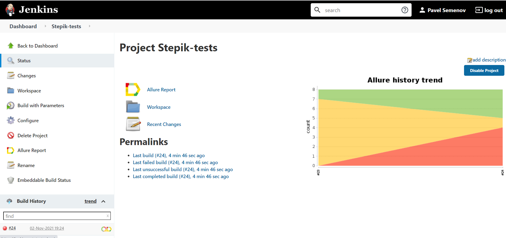
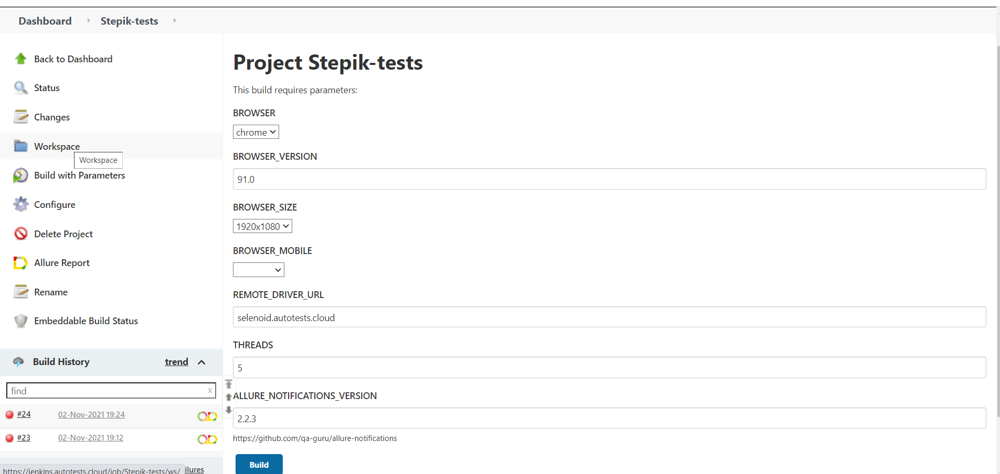
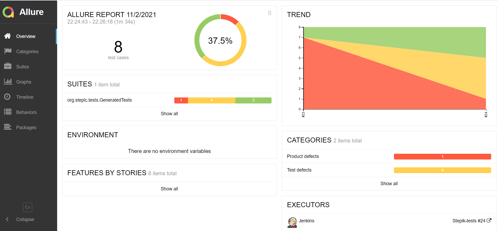
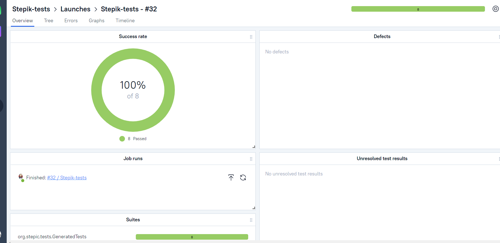
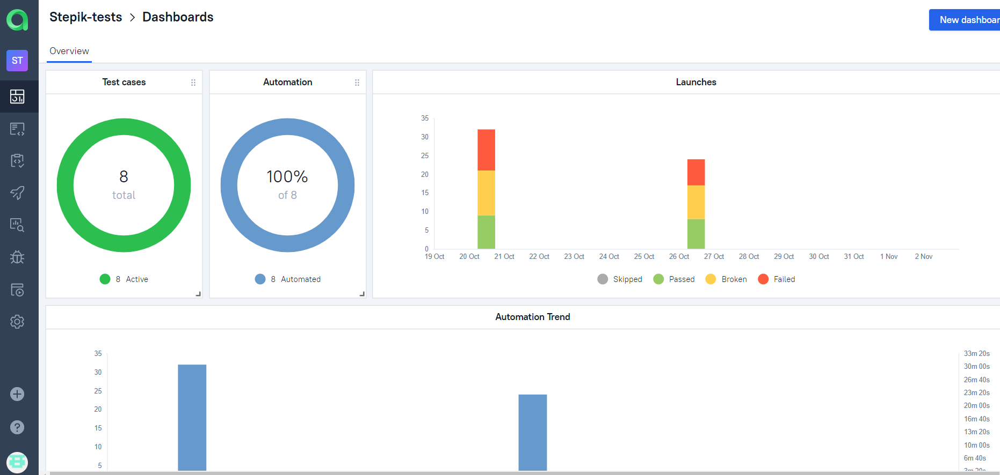
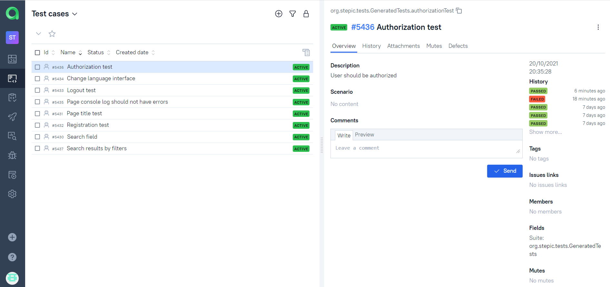
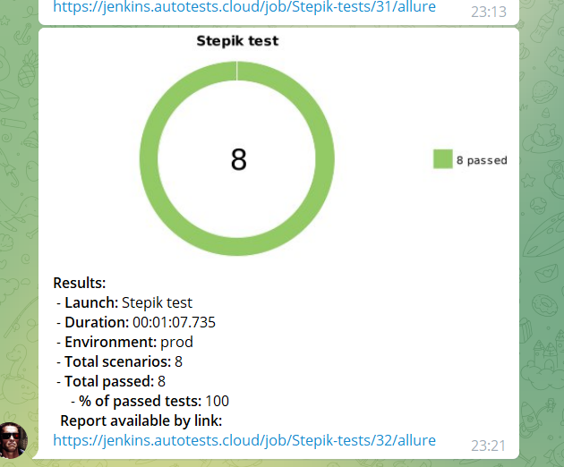

# Автотесты для [**образовательной платформы Stepik**](https://stepik.org/)

## Используемые технологии и инструменты

<a href="https://www.jetbrains.com/idea/">
    
</a>
<a href="https://www.jetbrains.com/idea/">
    
</a>
<a href="https://www.jetbrains.com/idea/">
    
</a>
<a href="https://www.jetbrains.com/idea/">
    
</a>
<a href="https://www.jetbrains.com/idea/">
    
</a>
<a href="https://www.jetbrains.com/idea/">
    
</a>
<a href="https://www.jetbrains.com/idea/">
    
</a>
<a href="https://www.jetbrains.com/idea/">
    
</a>
<a href="https://www.jetbrains.com/idea/">
    
</a>
<a href="https://www.jetbrains.com/idea/">
    
</a>
<a href="https://www.jetbrains.com/idea/">
    
</a>

IntelliJ IDEA, Java, Selenide, Selenoid, Gradle, JUnit5, Allure SE, Allure TestOps, Github, Jenkins, Telegram (reports)

## Реализованы проверки:
### UI
- [X] - Сайт имеет титл: "Catalog — Stepik"
- [X] - Консоль лог не содержит ошибок уровня SEVERE
- [X] - Смена языков интерфейса платформы и проверка на интернационализацию проекта
- [X] - Поиск курсов Java без фильтра, по вводу в поисковую строку
- [X] - Поиск курсов Java с фильтрами ( english language, with cert and Free)
- [X] - Авторизация пользователем
- [X] - Регистрация пользователя
- [X] - Logout с ЛК

Так как Jenkins является коммунальным стендом, то часть тестов не проходит из-за нагрузки на сервер.
Также представлен один "упавший" тест для наглядности


### Команда для запуска из терминала
Локально должны быть заданы параметры в local.properties, app.properties

Для запуска в несколько потоков
```
gradle clean -Dthreads=5
```
  
Run tests with filled remote.properties:
```bash
gradle clean test
```

Run tests with not filled remote.properties:
```bash
gradle clean -DremoteDriverUrl=https://%s:%s@selenoid.autotests.cloud/wd/hub/ -DvideoStorage=https://selenoid.autotests.cloud/video/ -Dthreads=1 test
```

Serve report:
```bash
allure serve build/allure-results
```

### Видео прохождения тестов, взятое из среды выполнения (из [**Selenoid**](https://selenoid.autotests.cloud/#/))


### Запуск в [**Jenkins**](https://jenkins.autotests.cloud/job/Stepik-tests/build?delay=0sec)
Удобный и имеющий широкое комьюнити иснтрумент, просто для освоения в виду большого количества учебного материала также удобная настройка pipelines
Статистика по запускам

Указание параметров для запуска


### Отчёт в Allure Report
Инструмент, не нуждающийся в представлении и мгновенно завоеваший популярность против автоматически генерирующихся отчетов с тестовых фреймворков Junit4,5 и TestNG


### Интеграция с TMS TestOps Allure
Удобная интеграция с Test Management System  Allure TestOps (ранее Allure EE), где есть возможность
хранить автотестовые прогоны с автоматическим заведением новых тест-кейсов из автоматизированных, так и создавать тест-кейсы вручную
(такие тест-кейсы также могут быть автоматизированы и при прогоне уже отображаться как авто-тесты, это делается через простой плагин и внесение @Id для автотестов)
- Автоматическая [**загрузка**](https://allure.autotests.cloud/project/542/launches) результата прогона тестов с Jenkins
  
- [**Визуализация**](https://allure.autotests.cloud/launch/5368) итогов пройденных тестов в Allure TestOps
  
- Автоматически [**загруженные**](https://allure.autotests.cloud/project/279/test-cases?treeId=0) тест-кейсы
  
### Уведомления в Telegram
Канал "Результаты автотестов для "M2"" [**для уведомлений**](https://t.me/joinchat/RHJoWcBT6H0wNDky)

